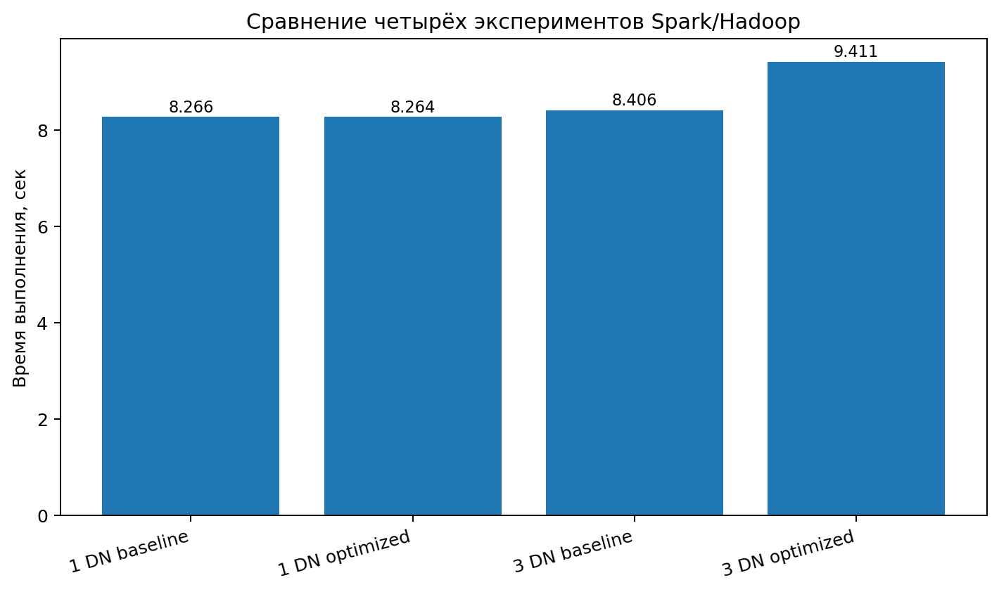

# Лабораторная работа 2. Spark / Hadoop

## Цель работы
Развернуть Hadoop и Spark в среде WSL/Docker, загрузить набор данных в HDFS, выполнить серию аналитических операций в Spark, измерить время выполнения и сравнить результаты для разных конфигураций кластера и версий приложения.

## Среда выполнения
- **Платформа:** WSL2 (Ubuntu)
- **Контейнеризация:** Docker / Docker Compose
- **Big Data стек:** Hadoop HDFS + PySpark
- **Java:** OpenJDK 17
- **Язык реализации:** Python

## Использованный датасет
Для работы использован набор данных **Online Retail**.

### Характеристики датасета
- более **541909 строк**;
- **6 признаков**;
- присутствуют разные типы данных;
- имеются категориальные признаки.

### Использованные поля
- `InvoiceNo`
- `StockCode`
- `Description`
- `Quantity`
- `InvoiceDate`
- `UnitPrice`
- `CustomerID`
- `Country`

В ходе предобработки был вычислен дополнительный признак:

```text
amount = Quantity * UnitPrice
```

## Состав проекта
- `app_baseline.py` — базовая версия Spark-приложения;
- `app_optimized.py` — оптимизированная версия приложения;
- `baseline_metrics.json` — метрики эксперимента 1 DataNode + baseline;
- `optimized_metrics.json` — метрики эксперимента 1 DataNode + optimized;
- `baseline_metrics_3dn.json` — метрики эксперимента 3 DataNode + baseline;
- `optimized_metrics_3dn.json` — метрики эксперимента 3 DataNode + optimized;
- `execution_times.png` — график времени выполнения;

## Конфигурации эксперимента
Были проведены четыре эксперимента:

1. **1 DataNode + baseline**
2. **1 DataNode + optimized**
3. **3 DataNode + baseline**
4. **3 DataNode + optimized**

## Анализ результатов
1. Во всех четырёх экспериментах были получены **идентичные аналитические результаты**:
   - после очистки осталось **36222** строки;
   - выделено **23** страны;
   - получено **2742** товарных кода;
   - найдено **897** клиентов.

   Это означает, что изменение конфигурации и применение оптимизации **не повлияло на корректность вычислений**.

2. Для конфигурации **1 DataNode** оптимизированная версия показала практически такое же время, как и baseline:
   - baseline: **8.266 сек**;
   - optimized: **8.264 сек**.

   Ускорение составило примерно **0.002 сек** или **0.02%**, то есть практически находится в пределах погрешности измерения.

3. Для конфигурации **3 DataNode** оптимизированная версия оказалась медленнее:
   - baseline: **8.406 сек**;
   - optimized: **9.411 сек**.

   Замедление составило примерно **1.005 сек** или около **11.96%**.

4. Увеличение числа DataNode с 1 до 3 не дало прироста производительности в рамках данного набора данных. Наиболее вероятная причина — сравнительно небольшой объём обрабатываемых данных после очистки и существенные накладные расходы на распределение задач, сетевое взаимодействие и shuffle-операции.



## Вывод
В ходе лабораторной работы были успешно выполнены все основные этапы:
- развернут Hadoop/HDFS в Docker под WSL;
- подготовлен и загружен датасет в HDFS;
- реализованы две версии Spark-приложения;
- проведены измерения для четырёх конфигураций;
- выполнено сравнение результатов и времени работы.

Практический результат показал, что для данного объёма данных и выбранных операций использование дополнительных DataNode и базовых оптимизаций Spark не гарантирует ускорения. При малом или среднем объёме данных накладные расходы распределённой обработки могут превысить выигрыш от параллелизма.

## Команды запуска
### 1 DataNode
```bash
python app_baseline.py --input hdfs://localhost:9000/input/online_retail.csv --output ./output_baseline --metrics ./baseline_metrics.json
python app_optimized.py --input hdfs://localhost:9000/input/online_retail.csv --output ./output_optimized --metrics ./optimized_metrics.json
```

### 3 DataNode
```bash
python app_baseline.py --input hdfs://localhost:9000/input/online_retail.csv --output ./output_baseline_3dn --metrics ./baseline_metrics_3dn.json
python app_optimized.py --input hdfs://localhost:9000/input/online_retail.csv --output ./output_optimized_3dn --metrics ./optimized_metrics_3dn.json
```